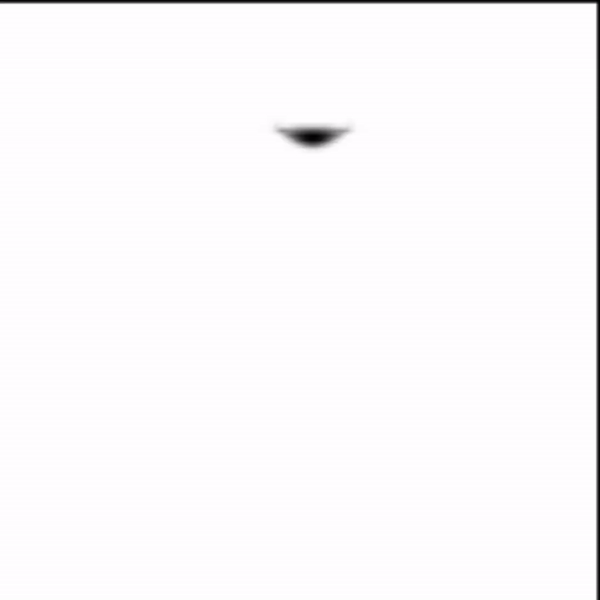

## Conjugate Gradient Method

### Basic Algorithms

Start with an initial divergence-free velocity field $\vec u^0$.

- For time step n = 0,1,2,...
- Determine a good time step ∆t to go from time $t_n$ to time $t_{n+1}$.
  - Set $\vec u^A = advect(\vec u^n, \Delta t, \vec u^n)$
  - Add $\vec u^B = \vec u^A + \Delta t \vec g$
  - Set $\vec u^{n+1} = project(\Delta t, \vec u^B)$

The $project (∆t, \vec u)$ routine does the following:

- Calculate the negative divergence $b$ (the right-hand side) with modifications at solid wall boundaries.
- Set the entries of $A$ (stored in `Adiag`, etc.).
- Construct the pre-conditioner (either MIC(0) for single threaded solves, or a more complicated domain decomposition set up for parallel solves).
- Solve $Ap = b$ with PCG.
- Compute the new velocities $\vec u^{n+1}$ according to the pressure-gradient update to $\vec u.$

### Congugate Gradient Algorithm

We have now defined a large system of linear equations for the unknown pressure values. We can conceptually think of it as a large coefficient matrix, $A$, times a vector consisting of all pressure unknowns, $p$, equal to a vector consisting of the negative divergences in each fluid grid cell, $b$ (with appropriate modifications at solid wall boundaries):

$$
Ap=b
$$

$p$ and $b$ are logically stored in a two or three-dimensional grid structure, since each entry corresponds to a grid cell.

---

$r_0 := b - Ax_0$

if $r_0$ is sufficiently small, then return $x_0$ as the result

$p_0 := r_0$

$k:=0$

repeat

$\alpha_k:=\frac{r_k^Tr_k}{p_k^Tp_k}$

$x_{k+1} := x_k + \alpha_kp_k$

$r_{k+1} : = r_k - \alpha_kAp_k$

if $r_{k+1}$ is sufficiently small, then exit loop

$\beta_k:=\frac{r_{k+1}^kr_{k+1}}{r_k^Tr_k}$

$p_{k+1} := r_{k+1} + \beta_kp_k$

$k:=k+1$

end repeat

return $x_{k+1}$ as the result

---

https://en.wikipedia.org/wiki/Conjugate_gradient_method#The_resulting_algorithm

**Preconditioned conjugate gradient(PCG)**

The matrix $A$ is a very well-known type of matrix, sometimes referred to as the five- or seven-point Laplacian matrix, in two or three dimensions respectively.

The preconditioned conjugate gradient (PCG) algorithm for solving $Ap = d$.

---

- Set initial guess $p = 0$ and residual vector $r = b$ ( if $r = 0$ then return p)
- Set auxiliary vector $z = applyPreconditioner(r)$, and search vector s = z
- $\sigma = dotproduct(z,r)$
- Loop until done (or maximum iterations exceeded):
  - Set auxiliary vector $z = applyA(s)$
  - $α = σ/dotproduct(z, s)$
  - Update $p←p+αs$ and $r←r−αz$
  - If $max|r|≤tol$ then return $p$
  - Set auxiliary vector $z = applyPreconditioner(r)$
  - $σ_{new} = dotproduct(z, r)$
  - $β = σ_{new}/σ$
  - Set search vector $s=z+βs$
  - $σ=σ_{new}$
- Return $p$ (and report iteration limit exceeded)

---

**Incomplete Cholesky**

$$
A=LL^T
$$

This is called the `Cholesky` factorization. The original system $Ap = b$ is the same as $L(L^T p) = b$, which we can solve as

$$
solve\text{ } Lq = b \text{ with forward substitution},
$$

$$
\text{solve } L^T p = q \text{ with backward substitution}.


$$

The main reason that we don’t typically use this method for fluids is that although $A$ has very few non-zeros, $L$ can have a lot. In three dimensions the amount of fill-in (extra non-zeros in $L$) is particularly bad; direct solvers that take this approach can easily fail on 3D problems due to lack of memory.

Basic Incomplete `Cholesky` tackles this problem with a very simple idea: whenever the `Cholesky` algorithm tries to create a new non-zero in a location that is zero in $A$, cancel it—keep it as zero. On the one hand, the resulting $L$ is just as sparse as $A$, and memory is no longer an issue. On the other hand, we deliberately made errors: $A \neq LL^T$ now. However, hopefully the “incomplete” factorization is close enough to $A$ that doing the solves in Equation above is close enough to applying $A^{−1}$ so that we have a useful pre-conditioner for PCG!

Technically, performing Incomplete `Cholesky` only allowing non-zeros in $L$ where there are non-zeros in $A$ is called level zero: $IC(0)$.

To make this more precise, $IC(0)$ constructs a lower-triangular matrix $L$ with the same non-zero pattern as the lower triangle of $A$, such that $LL^T = A$ in the locations where $A$ is non-zero. The only error is that $LL^T$ is non-zero in some other locations where $A$ is zero.

Assume we order our grid cells (and the corresponding rows and columns of $A$) lexicographically, say along the i-dimension first, then the j-dimension, and finally the k-dimension. Suppose we split $A$ up into its strict lower triangle $F$ and diagonal $D$:

$$
A = F + D + F^T
$$

Then, it can be shown for the particular $A$ we’re solving—though we won’t show it here—that the IC(0) factor $L$ is of the form

$$
L = FE^{-1} + E
$$

where $E$ is a diagonal matrix. That is, all we need to compute and store are the diagonal entries of $L$, and we can infer the others just from $A$!

Crunching through the algebra gives the following formulas for computing the entries along the diagonal of E. In two dimensions,

$$
E_{(i,j)}=\sqrt{A_{(i,j),(i,j)} - (A_{(i-1,j),(i,j)}/E_{(i-1,j)})^2 - (A_{(i,j-1),(i,j)}/E_{(i,j-1)})^2}
$$

In three dimensions,

$$
E_{(i,j,k)}=\sqrt{A_{(i,j,k),(i,j,k)} - (A_{(i-1,j,k),(i,j,k)}/E_{(i-1,j,k)})^2 - (A_{(i,j-1,k),(i,j,k)}/E_{(i,j-1,k)})^2 - (A_{(i,j,k-1),(i,j,k)}/E_{(i,j,k-1)})^2}
$$

In these equations, we replace terms referring to a non-fluid cell (or cell that lies off the grid) with zero. Also note that the superscript two is an exponent, nothing to do with time steps: those entries of E are squared.

**the modified incomplete Cholesky preconditioner (MIC)**

Incomplete `Cholesky` is a good pre-conditioner that can effectively reduce our iteration count when solving the pressure equations, and is often the default choice when preconditioning any general matrix. But, for almost no extra cost, we can do better for our particular $A$! A slight tweak to IC, Modified Incomplete `Cholesky` (MIC), scales significantly better: if our grid is n grid cells wide, regular $IC(0)$ will require $O(n)$ iterations but MIC(0) will converge in only $O(n^{1/2})$ iterations, with a fairly low hidden constant. Modified Incomplete Cholesky works exactly like Incomplete `Cholesky`, except instead of just discarding those unwanted non-zeros, we account for them by adding them to the diagonal of $L$.

To make this more precise, MIC(0) constructs a lower-triangular matrix L with the same non-zero pattern as the lower triangle of $A$, such that

- The off-diagonal non-zero entries of $A$ are equal to the corresponding ones of ($LL^T$ ).
- The sum of each row of $A$ is equal to the sum of each row of ($LL^T$).

This boils down to a slightly different calculation for the diagonal entries: the modified L is also equal to $FE^{−1} +E$, just for a different E. In two dimensions,

$$
E_{(i,j)}=\sqrt{A_{(i,j),(i,j)} - (A_{(i-1,j),(i,j)}/E_{(i-1,j)})^2 - (A_{(i,j-1),(i,j)}/E_{(i,j-1)})^2 - A_{(i-1,j)(i,j)}A_{(i-1,j),(i-1,j+1)}/E^2_{(i-1,j)} - A_{(i,j-1),(i,j)}A_{(i,j-1),(i+1,j-1)}/E^2_{(i,j-1)}}
$$

In three dimensions,

$$
E_{(i,j,k)}=\sqrt{A_{(i,j,k),(i,j,k)} - (A_{(i-1,j,k),(i,j,k)}/E_{(i-1,j,k)})^2 - (A_{(i,j-1,k),(i,j,k)}/E_{(i,j-1,k)})^2 - (A_{(i,j,k-1),(i,j,k)}/E_{(i,j,k-1)})^2 - A_{(i-1,j,k),(i,j,k)}\times (A_{(i-1,j,k),(i-1,j+1,k)} + A_{(i-1,j,k),(i-1,j,k+1)})/E^2_{(i-1,j,k)}- A_{(i,j-1,k),(i,j,k)}\times (A_{(i,j-1,k),(i+1,j-1,k)} + A_{(i,j-1,k),(i,j-1,k+1)})/E^2_{(i,j-1,k)} - A_{(i,j,k-1),(i,j,k)}\times (A_{(i,j,k-1),(i+1,j,k+1)} + A_{(i,j,k-1),(i,j+1,k-1)})/E^2_{(i,j,k-1)}}
$$

In practice, you can squeeze out even better performance by taking a weighted average between the regular Incomplete `Cholesky` formula and the modified one, typically weighting with `0.97` or more (getting closer to 1 for larger grids). Figure below for pseudocode to implement this in three dimensions. We actually compute and store the reciprocals of the diagonal entries of $E$ in a grid variable called `precon`, to avoid divides when applying the pre-conditioner.

### Code Implementation

**Core Function**

```cpp
void update(double timestep) {
    buildRhs();
    buildPressureMatrix(timestep);
    buildPreconditioner();
    project(600);
    applyPressure(timestep);

    _d->advect(timestep, *_u, *_v);
    _u->advect(timestep, *_u, *_v);
    _v->advect(timestep, *_u, *_v);

    _d->flip();
    _u->flip();
    _v->flip();
}
```

**Build Pressure Matrix ${A}$ `_aDiag` `_aPlusX` `_aPlusY`**

```cpp
/* Builds the pressure matrix. Since the matrix is very sparse and
 * symmetric, it allows for memory friendly storage.
 */
void buildPressureMatrix(double timestep) {
    double scale = timestep/(_density*_hx*_hx);

    memset(_aDiag, 0, _w*_h*sizeof(double));

    for (int y = 0, idx = 0; y < _h; y++) {
        for (int x = 0; x < _w; x++, idx++) {
            if (x < _w - 1) {
                _aDiag [idx    ] +=  scale;
                _aDiag [idx + 1] +=  scale;
                _aPlusX[idx    ]  = -scale;
            } else
                _aPlusX[idx] = 0.0;

            if (y < _h - 1) {
                _aDiag [idx     ] +=  scale;
                _aDiag [idx + _w] +=  scale;
                _aPlusY[idx     ]  = -scale;
            } else
                _aPlusY[idx] = 0.0;
        }
    }
}
```

**Build Preconditioner `_precon`**
This boils down to a slightly different calculation for the diagonal entries: the modified L is also equal to $FE^{−1} +E$, just for a different E. In two dimensions,

$$
E_{(i,j)}=\sqrt{A_{(i,j),(i,j)} - (A_{(i-1,j),(i,j)}/E_{(i-1,j)})^2 - (A_{(i,j-1),(i,j)}/E_{(i,j-1)})^2 - A_{(i-1,j)(i,j)}A_{(i-1,j),(i-1,j+1)}/E^2_{(i-1,j)} - A_{(i,j-1),(i,j)}A_{(i,j-1),(i+1,j-1)}/E^2_{(i,j-1)}}
$$

I
The calculation of the MIC(0) pre-conditioner in two dimensions.

---

- Set tuning constant $τ = 0.97$ and safety constant $σ = 0.25$
- For $i=1$ to $nx$, $j=1$ to $ny$:

  - If $cell (i,j)$ is fluid:

    - Set $e = Adiag_{i,j} − (Aplusi_{i−1,j} ∗ preconi_{i−1,j})^2 −(Aplusj_{i,j−1} ∗precon_{i,j−1})^2 −τ[Aplusi_{i−1,j,k} ∗ (Aplusj_{i−1,j,k}
    +Aplusk_{i−1,j,k} )
    ∗precon^2_{i−1,j,k} - Aplusj_{i,j−1,k}
      ∗(Aplusi_{i,j−1,k} +Aplusk_{i,j−1,k})
      ∗ precon^2_{i,j−1,k}
      +Aplusk_{i,j,k−1}∗(Aplusi_{i,j,k−1} + Aplusj_{i,j,k−1})
    ∗precon^2_{i,j,k−1}]$

    - If $e<σAdiag_{i,j,k}$ set $e=Adiag_{i,j,k}$
    - $precon_{i,j,k} = 1/ \sqrt{e}$

---

```cpp
/* Builds the modified incomplete Cholesky preconditioner */
void buildPreconditioner() {
    const double tau = 0.97;
    const double sigma = 0.25;

    for (int y = 0, idx = 0; y < _h; y++) {
        for (int x = 0; x < _w; x++, idx++) {
            double e = _aDiag[idx];

            if (x > 0) {
                double px = _aPlusX[idx - 1]*_precon[idx - 1];
                double py = _aPlusY[idx - 1]*_precon[idx - 1];
                e = e - (px*px + tau*px*py);
            }
            if (y > 0) {
                double px = _aPlusX[idx - _w]*_precon[idx - _w];
                double py = _aPlusY[idx - _w]*_precon[idx - _w];
                e = e - (py*py + tau*px*py);
            }

            if (e < sigma*_aDiag[idx])
                e = _aDiag[idx];

            _precon[idx] = 1.0/sqrt(e);
        }
    }
}
```

**Conjugate Gradients Solver**

The preconditioned conjugate gradient (PCG) algorithm for solving $Ap = d$.

---

- Set initial guess $p = 0$ and residual vector $r = b$ ( if $r = 0$ then return p)
- Set auxiliary vector $z = applyPreconditioner(r)$, and search vector s = z
- $\sigma = dotproduct(z,r)$
- Loop until done (or maximum iterations exceeded):
  - Set auxiliary vector $z = applyA(s)$
  - $α = σ/dotproduct(z, s)$
  - Update $p←p+αs$ and $r←r−αz$
  - If $max|r|≤tol$ then return $p$
  - Set auxiliary vector $z = applyPreconditioner(r)$
  - $σ_{new} = dotproduct(z, r)$
  - $β = σ_{new}/σ$
  - Set search vector $s=z+βs$
  - $σ=σ_{new}$
- Return $p$ (and report iteration limit exceeded)

```cpp
/* Conjugate gradients solver */
void project(int limit) {
    memset(_p, 0,  _w*_h*sizeof(double)); /* Initial guess of zeroes */
    applyPreconditioner(_z, _r);
    memcpy(_s, _z, _w*_h*sizeof(double));

    double maxError = infinityNorm(_r);
    if (maxError < 1e-5)
        return;

    double sigma = dotProduct(_z, _r);

    for (int iter = 0; iter < limit; iter++) {
        matrixVectorProduct(_z, _s);
        double alpha = sigma/dotProduct(_z, _s);
        scaledAdd(_p, _p, _s, alpha);
        scaledAdd(_r, _r, _z, -alpha);

        maxError = infinityNorm(_r);
        if (maxError < 1e-5) {
            printf("Exiting solver after %d iterations, maximum error is %f\n", iter, maxError);
            return;
        }

        applyPreconditioner(_z, _r);

        double sigmaNew = dotProduct(_z, _r);
        scaledAdd(_s, _z, _s, sigmaNew/sigma);
        sigma = sigmaNew;
    }

    printf("Exceeded budget of %d iterations, maximum error was %f\n", limit, maxError);
}
/* Apply preconditioner to vector `a' and store it in `dst' */
void applyPreconditioner(double *dst, double *a) {
    for (int y = 0, idx = 0; y < _h; y++) {
        for (int x = 0; x < _w; x++, idx++) {
            double t = a[idx];

            if (x > 0)
                t -= _aPlusX[idx -  1]*_precon[idx -  1]*dst[idx -  1];
            if (y > 0)
                t -= _aPlusY[idx - _w]*_precon[idx - _w]*dst[idx - _w];

            dst[idx] = t*_precon[idx];
        }
    }

    for (int y = _h - 1, idx = _w*_h - 1; y >= 0; y--) {
        for (int x = _w - 1; x >= 0; x--, idx--) {
            idx = x + y*_w;


            double t = dst[idx];

            if (x < _w - 1)
                t -= _aPlusX[idx]*_precon[idx]*dst[idx +  1];
            if (y < _h - 1)
                t -= _aPlusY[idx]*_precon[idx]*dst[idx + _w];

            dst[idx] = t*_precon[idx];
        }
    }
}
/* Returns the dot product of vectors `a' and `b' */
double dotProduct(double *a, double *b) {
    double result = 0.0;
    for (int i = 0; i < _w*_h; i++)
        result += a[i]*b[i];
    return result;
}
/* Multiplies internal pressure matrix with vector `b' and stores the result in `dst' */
void matrixVectorProduct(double *dst, double *b) {
    for (int y = 0, idx = 0; y < _h; y++) {
        for (int x = 0; x < _w; x++, idx++) {
            double t = _aDiag[idx]*b[idx];

            if (x > 0)
                t += _aPlusX[idx -  1]*b[idx -  1];
            if (y > 0)
                t += _aPlusY[idx - _w]*b[idx - _w];
            if (x < _w - 1)
                t += _aPlusX[idx]*b[idx +  1];
            if (y < _h - 1)
                t += _aPlusY[idx]*b[idx + _w];

            dst[idx] = t;
        }
    }
}

/* Computes `dst' = `a' + `b'*`s' */
void scaledAdd(double *dst, double *a, double *b, double s) {
    for (int i = 0; i < _w*_h; i++)
        dst[i] = a[i] + b[i]*s;
}

/* Returns maximum absolute value in vector `a' */
double infinityNorm(double *a) {
    double maxA = 0.0;
    for (int i = 0; i < _w*_h; i++)
        maxA = max(maxA, fabs(a[i]));
    return maxA;
}
```

### Render Result

<div align="center">

</div>
