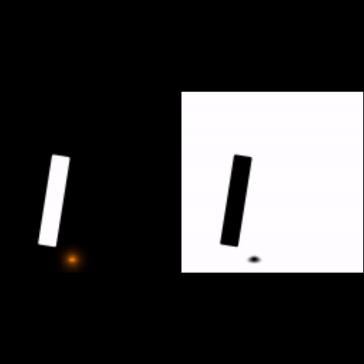

# Incremental-Fluids

## Incompressible Navier-Stokes Equations

$$
\begin{align}
\frac{\partial \vec u}{\partial \vec t} + \vec u \cdot \nabla \vec u + \frac{1}{\rho}\nabla p &= \vec g + \nu \nabla \cdot \nabla \vec u \\
\nabla \cdot \vec u &= 0
\end{align}
$$

- $\vec u$ ：the velocity of the fluid
- $\rho$ : the density of the fluid
- $p$ : pressure, the force per unit area that the fluid exerts on anything
- $\vec g$ : acceleration due to gravity → **body forces**
- $\vec \nu$ : kinematic viscosity [力] 动力粘度 . It measures how much the fluid resists deforming while it flows (or more intuitively, how difficult it is to stir)

### Spliting the Fluid Equations

In particular, we’ll separate out the advection part, the body forces (gravity) part, and the pressure/incompressibility part.

That is, we’ll work out methods for solving these simpler equations:

$$
\begin{align}
\frac{Dq}{Dt} &= 0 \text{(advection)} \\
\frac{\partial \vec u}{\partial t} &= \vec g \text{(body forces)} \\
\frac{\partial \vec u}{\partial t} + \frac{1}{\rho}\Delta p &= 0 \text { such that } \nabla \cdot \vec u = 0. \text{pressure / incompressibility}
\end{align}
$$

We used the generic quantity $q$ in the advection equation because we may be interested in advecting other things, not just velocity $\vec v$

## Basic Algorithms

Start with an initial divergence-free velocity field $\vec u^0$.

- For time step n = 0,1,2,...
- Determine a good time step ∆t to go from time $t_n$ to time $t_{n+1}$.
  - Set $\vec u^A = advect(\vec u^n, \Delta t, \vec u^n)$
  - Add $\vec u^B = \vec u^A + \Delta t \vec g$
  - Set $\vec u^{n+1} = project(\Delta t, \vec u^B)$

## Render Results

| Notes                                    | Render Results                                    |
| ---------------------------------------- | ------------------------------------------------- |
| [1-matrixless](./1-matrixless/README.md) |           |
| 2-better-advection                       |     |
| 3-conjugate-gradients                    |  |
| 4-solid-boundaries                       |     |
| 5-curved-boundaries                      |    |
| 6-heat                                   |                 |
| 7-variable-density                       |     |
| 8-flip                                   |                 |
